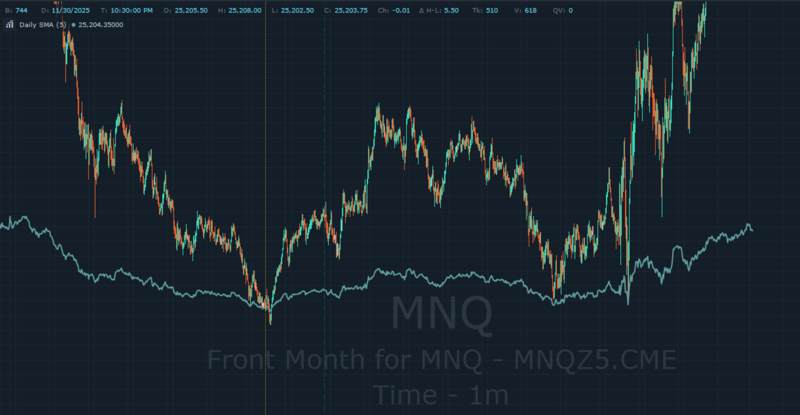

# Daily Simple Moving Average (DSMA) Indicator

A Quantower indicator that plots a Simple Moving Average calculated from daily bars onto any intraday chart.

*5-period Daily SMA displayed on a 1-minute MNQ chart.*

## Overview

Intraday charts lack context from higher timeframes. This indicator solves that by overlaying a daily-calculated SMA directly onto any chart timeframe, eliminating the need to switch between charts to see where price sits relative to the daily trend.

The indicator automatically fetches daily bar data regardless of your chart's timeframe and plots the SMA as a continuous line.

## Parameters

| Parameter | Default | Description |
|-----------|---------|-------------|
| Period | 5 | Number of daily bars for SMA calculation |
| Price Type | Close | Price used for calculation (Close, Open, High, Low, Typical, Median, Weighted) |

## Building from Source

### Prerequisites

- Visual Studio 2019 or later
- Quantower platform installed
- Quantower Algo extension for Visual Studio

### Setup

1. Open Visual Studio and create a new project using the **Quantower Indicator** template
2. Replace the generated code with `DailySimpleMovingAverage.cs`
3. Ensure the project references `TradingPlatform.BusinessLayer` (included with Quantower Algo)
4. Build the solution (Ctrl+Shift+B)

### Troubleshooting

**Indicator not appearing in Quantower**
- Verify the compiled `.dll` is in `%USERPROFILE%\Documents\Quantower\Scripts\Indicators`
- Restart Quantower after adding new indicators

**Indicator shows 0.0000 or no line**
- Open Quantower's Log panel and filter for `[DSMA]`
- Common issues logged: insufficient historical data, null symbol, GetHistory failures

## Technical Notes

- Automatically fetches daily bars regardless of chart timeframe
- Handles market holidays and weekends by extending lookback if insufficient bars are returned
- Logs errors to Quantower's log panel with `[DSMA]` prefix for easy filtering

## License

Copyright © 2025 Structured Trading LLC. All rights reserved.